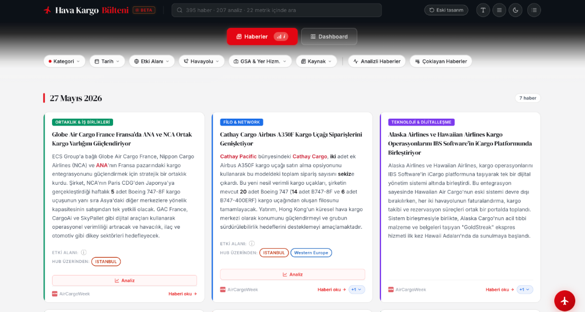

<p align="center">
  <br/>
  <a href="#"></a>
  <a href="#"></a>
  <a href="#"></a>
  <br/>
  <br/>
</p>

<p align="center">
  <h1 align="center">✈️ Hava Kargo Bülteni & Dashboard</h1>
</p>

<h3 align="center">Hava kargo sektör haberlerini, küresel makro-ekonomik verileri, petrol fiyat endekslerini ve yapay zeka destekli akıllı bir asistanı tek bir çatı altında toplayan premium, tek sayfalık modern bir platform.</h3>

<p align="center">
  
</p>

Uygulama; zengin görsel tasarımı, hızlı filtreleme mekanizmaları, interaktif grafik entegrasyonları ve **n8n + Gemini API** tabanlı yapay zeka altyapısıyla sektör profesyonellerine yönelik geliştirilmiştir.


## 🚀 Temel Özellikler

### 1. Dinamik Haber Akışı ve Filtreleme
* **Kategori Bazlı Filtreleme:** Haberleri, *Filo & Network*, *Teknoloji*, *Ortaklık*, *Atama* ve *Diğer* kategorilere göre anında süzme.
* **Gelişmiş Havayolu & Bölge Eşleşmesi:** Haber metni analizine göre havayolları ve global/yerel bölgeler (Avrupa, Uzak Doğu, Orta Doğu vb.) otomatik tespit edilir ve filtrelenir.
* **Çoklu Kaynak Desteği (Duplicate Tespiti):** Benzer içerikli haber kaynakları gruplanarak haber kartı altında butonla gösterilir.

### 2. Ekonomi & Enerji Dashboard'u
* **FRED API Entegrasyonu:** Brent ve WTI petrol fiyat endeksleri anlık çekilerek çizgi grafikler ile görselleştirilir.
* **IMF WEO Entegrasyonu:** Küresel GSYH (GDP) büyüme oranları ve tüketici fiyat endeksi (CPI) tahminleri interaktif bar grafiklerinde sunulur.
* **Yıllık Tahmin Popover:** Ülke/Bölge barlarına tıklandığında açılan popup ile *Gerçekleşen*, *Tahmini* ve *Öngörü* verileri listelenir ve tek tıkla KPI kartı çizgi grafiğe dönüştürülebilir.

### 3. Yapay Zeka Destekli Haber Asistanı
* **Cosine Similarity & Semantic Search:** Sorulan soru Gemini Embedding API ile vektörleştirilir ve n8n veritabanındaki haber embeddingleri ile karşılaştırılarak en alakalı 12 haber bağlam olarak Gemini modeline gönderilir.
* **İptal/Duraklatma Kontrolü (Abort):** Yanıt oluşturulurken gönder butonu duraklatma (Pause) simgesine dönüşür ve HTTP bağlantısı `AbortController` ile anında kesilebilir.
* **Sorgu Hizalama (Scroll to Top):** Asistan cevabı tamamladığında ekranın kontrolsüzce kayması önlenir ve sorulan soru sohbet panelinin en tepesine (`-12px` boşlukla) yumuşakça hizalanır.
* **Akıllı Selamlama & Kısalık Kuralları:** İlk soruda asistan *"Merhaba,"* diyerek başlar; takip eden sorularda ise gereksiz kalıplardan kaçınarak doğrudan, net ve kısa yanıtlar verir.
* **Tıklanabilir Başlıklar:** Haber asistanı panelinde referans verilen haber başlıklarına tıklandığında, ilgili haber kartı ana ekranda otomatik süzülür. Ayrıca, cevapta yer alan tüm haberler, ilgili butona tıklanarak tek sayfada da görüntülenebilir.


### 4. Gelişmiş Haber Okuyucu ve Çeviri Modülü
* **Temiz Sayfada Tek Tıkla Erişim:** Herhangi bir haber kartına tıklandığında, kullanıcının dış sitelere gitmesine gerek kalmadan, reklam ve dikkat dağıtıcı öğelerden tamamen arındırılmış temiz bir okuma ekranı açılır.
* **Sayfa Bütününü Çevirme:** Yabancı kaynaklı haberler tek tıkla ("Çevir" butonu aracılığıyla) Google Translate API entegrasyonu sayesinde Türkçe'ye çevrilebilir.
* **Eş Zamanlı Kaydırma:** Orijinal metin ile Türkçe çeviriyi yan yana gösteren yapıda, bir taraf kaydırıldığında diğer tarafın da eş zamanlı sağlanır. Orijinal metin ile çevirilerin yakın hizalanması için haber görseli gösterimi kapatılır.
* **Cümle Bazlı Vurgulama:** Okuyucu panelinde fare ile bir cümlenin üzerine gelindiğinde, cümlenin orijinal dildeki karşılığı ile Türkçe  karşılığı aynı anda vurgulanarak okuma takibi kolaylaştırılır.
* **Kaynak Sekmeleri:** Aynı haberin birden fazla kaynağı mevcutsa, okuyucu penceresinin en üstünde sekmeler halinde listelenir ve kaynaklar arasında tek tıkla geçiş yapılabilir.

## 🛠️ Kullanılan Teknolojiler

* **Frontend:** HTML5, Vanilla CSS3 (CSS Variables, Glassmorphism, Responsive Grid), Vanilla JavaScript (ES6+).
* **Veri Görselleştirme:** Chart.js.
* **Yazı Tipleri:** Google Fonts (Inter, DM Serif Display, Fraunces).
* **Backend & Otomasyon:** n8n Workflow Otomasyon Sistemi, Cloudflare Worker.
* **Yapay Zeka:** Google Gemini API (gemini-3.5-flash & gemini-embedding-001).

---

## 🔌 n8n Webhook ve Servis Bağlantıları

Uygulamanın veri akışı, n8n üzerinde çalışan şu aktif iş akışları (workflows) tarafından yönetilir:

* **Haber AI v2:** Asistanın soru-cevap ve veri getirme işlemlerini yürütür.
* **Haber AI Feedback:** Kullanıcının yapay zeka cevaplarına verdiği 👍/👎 geri bildirimlerini kaydeder.
* **FRED Proxy:** FRED petrol fiyat verilerini CORS engeline takılmadan çeker (24 saat önbelleklenir).
* **IMF Data :** IMF küresel büyüme ve enflasyon verilerini sunar (7 gün önbelleklenir).
* **Haber Embedding Oluşturucu:** Habzer veri tabanını düzenli aralıklarla kontrol ederek eksik haberlerin Gemini embeddinglerini oluşturur.

---

## 💻 Kurulum ve Çalıştırma

Projeyi yerel bilgisayarınızda çalıştırmak oldukça basittir, çünkü herhangi bir derleme (build) adımına ihtiyaç duymaz:

1. Bu depoyu klonlayın:
   ```bash
   git clone https://github.com/demirbasemre/haberozetleri.git
   ```
2. Proje dizinine gidin:
   ```bash
   cd haberozetleri
   ```
3. `index.html` dosyasını herhangi bir modern tarayıcıda doğrudan çift tıklayarak veya yerel bir canlı sunucu (Live Server) yardımıyla açın.

---

*Son Güncelleme: Mayıs 2026*
