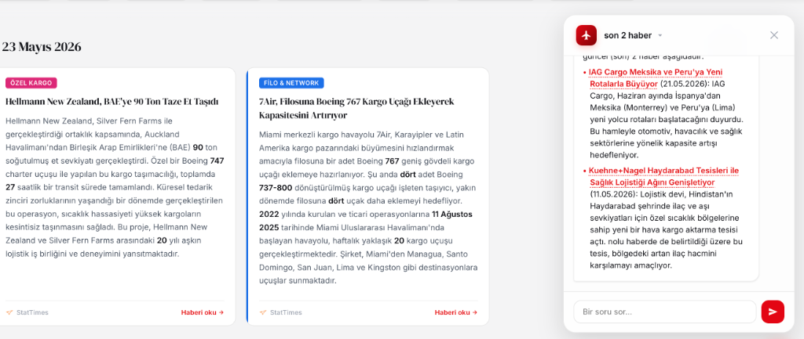
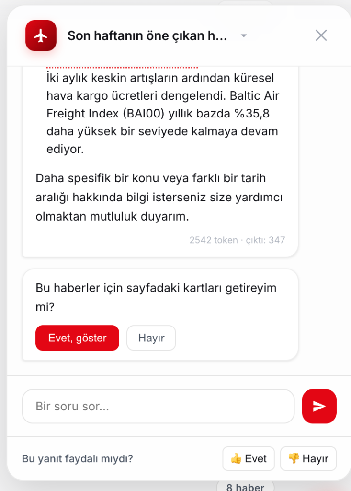
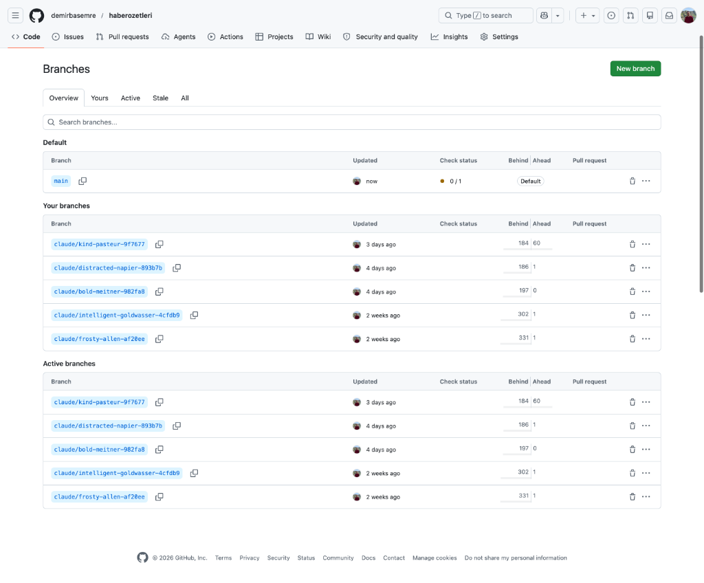
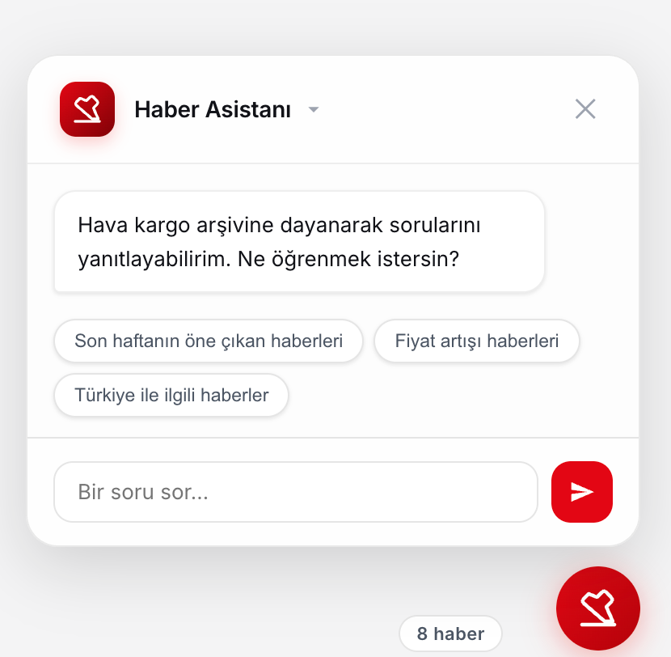

# ✈️ Hava Kargo Bülteni & Yapay Zeka Haber Asistanı

Hava Kargo Bülteni, hava kargo sektörü haberlerini, küresel makro-ekonomik verileri, petrol fiyat endekslerini ve yapay zeka destekli akıllı bir asistanı tek bir çatı altında toplayan premium, tek sayfalık (SPA) modern bir gösterge panelidir (Dashboard).

Uygulama, zengin görsel tasarımı, hızlı filtreleme mekanizmaları, interaktif Chart.js grafik entegrasyonları ve **n8n + Gemini API** tabanlı yapay zeka altyapısıyla sektör profesyonellerine yönelik geliştirilmiştir.

---

## 📸 Ekran Görüntüleri

### 📊 Makro-Ekonomi & Petrol Fiyat Göstergeleri

*FRED ve IMF verileriyle beslenen interaktif Chart.js çizgi ve bar grafikleri içeren KPI gösterge paneli.*

---

### 🤖 Yapay Zeka Asistanı (Sohbet Arayüzü)

*Haber arşivine ve embedding veritabanına dayalı akıllı arama, duraklatma kontrolü, iskelet (skeleton) yükleme efektleri ve otomatik hizalanan soru yapısı.*

---

### 💡 Hazır Soru Önerileri (Çipler)

*Entegratör ve havayolu bazlı hızlı soru sorma çipleri ve yumuşak geçiş animasyonları.*

---

### 📰 Haber Filtreleme ve Arama Arayüzü

*Havayolu, kaynak, bölge ve kategori bazlı filtreleme, çoklu kaynak desteği ve interaktif kart yapısı.*

---

## 🚀 Temel Özellikler

### 1. Dinamik Haber Akışı ve Filtreleme (`#news-panel`)
* **Kategori Bazlı Filtreleme:** Haberleri *Filo & Network*, *Teknoloji*, *Ortaklık*, *Özel Günler*, *Atama* ve diğer kategorilere göre anında süzme.
* **Gelişmiş Havayolu & Bölge Eşleşmesi:** Metin analizine göre havayolları ve global/yerel bölgeler (Avrupa, Uzak Doğu, Orta Doğu vb.) otomatik tespit edilir ve filtrelenir.
* **Çoklu Kaynak Desteği (Duplicate Tespiti):** Benzer içerikli haberler gruplanarak kart altında "Daha fazla kaynak" butonuyla gösterilir.
* **Tıklanabilir Başlıklar:** Yapay zeka panelinde referans verilen haber başlıklarına tıklandığında, ilgili haber kartı ana ekranda otomatik süzülür.

### 2. Ekonomi & Enerji Dashboard'u (`#dashboard-panel`)
* **FRED API Entegrasyonu:** Brent ve WTI petrol fiyat endeksleri anlık çekilerek Chart.js çizgi grafikleri ile görselleştirilir.
* **IMF WEO Entegrasyonu:** Küresel GSYH (GDP) büyüme oranları ve tüketici fiyat endeksi (CPI) tahminleri interaktif bar grafiklerinde sunulur.
* **Yıllık Tahmin Popover:** Ülke barlarına tıklandığında açılan popup ile *Gerçekleşen*, *Tahmini* ve *Öngörü* verileri listelenir ve tek tıkla KPI kartı çizgi grafiğe dönüştürülebilir.

### 3. Yapay Zeka Destekli Haber Asistanı (`#ai-panel`)
* **Cosine Similarity & Semantic Search:** Sorulan soru Gemini Embedding API ile vektörleştirilir ve n8n veritabanındaki haber embeddingleri ile karşılaştırılarak en alakalı 12 haber bağlam (context) olarak Gemini modeline gönderilir.
* **İptal/Duraklatma Kontrolü (Abort):** Yanıt oluşturulurken gönder butonu duraklatma (Pause) simgesine dönüşür ve HTTP bağlantısı `AbortController` ile anında kesilebilir.
* **Sorgu Hizalama (Scroll to Top):** Asistan cevabı tamamladığında ekranın kontrolsüzce kayması önlenir ve sorulan soru sohbet panelinin en tepesine (`-12px` boşlukla) yumuşakça hizalanır.
* **Akıllı Selamlama & Kısalık Kuralları:** İlk soruda asistan *"Merhaba,"* diyerek başlar; takip eden sorularda ise gereksiz kalıplardan kaçınarak doğrudan, net ve kısa yanıtlar verir.

### 4. Gizli Haber Düzenleme Modu (`#news-editor-panel`)
* `Ctrl + Shift + E` kısayoluyla açılan bu gizli panel sayesinde, haber kartlarının içerikleri tarayıcı üzerinden kolayca güncellenerek n8n Webhook aracılığıyla GitHub'a otomatik kaydedilebilir.

---

## 🛠️ Teknoloji Yığını

* **Frontend:** HTML5, Vanilla CSS3 (CSS Variables, Glassmorphism, Responsive Grid), Vanilla JavaScript (ES6+).
* **Veri Görselleştirme:** Chart.js.
* **Yazı Tipleri:** Google Fonts (Inter, DM Serif Display, Fraunces).
* **Backend & Otomasyon:** n8n Workflow Otomasyon Sistemi.
* **Yapay Zeka:** Google Gemini API (gemini-3-flash-preview & gemini-embedding-001).

---

## 🔌 n8n Webhook ve Servis Bağlantıları

Uygulamanın veri akışı, n8n üzerinde çalışan şu aktif iş akışları (workflows) tarafından yönetilir:

* **Haber AI v2 (`/webhook/haber-ai-v2`):** Asistanın soru-cevap ve veri getirme işlemlerini yürütür.
* **Haber AI Feedback (`/webhook/haber-ai-feedback`):** Kullanıcının yapay zeka cevaplarına verdiği 👍/👎 geri bildirimlerini kaydeder.
* **FRED Proxy (`/webhook/fred-proxy`):** FRED petrol fiyat verilerini CORS engeline takılmadan çeker (24 saat önbelleklenir).
* **IMF Data (`/webhook/imf-data`):** IMF küresel büyüme ve enflasyon verilerini sunar (7 gün önbelleklenir).
* **Todo Sync (`/webhook/todos`):** Yapılacaklar listesi görevlerini senkronize tutar.
* **Haber Embedding Oluşturucu (`plj2qFJcMKdsRJLT`):** Seen Articles tablosunu düzenli aralıklarla kontrol ederek eksik haberlerin Gemini embeddinglerini oluşturur.

---

## 💻 Kurulum ve Çalıştırma

Projeyi yerel bilgisayarınızda çalıştırmak oldukça basittir, çünkü herhangi bir derleme (build) adımına ihtiyaç duymaz:

1. Bu depoyu klonlayın:
   ```bash
   git clone https://github.com/demirbasemre/haberozetleri.git
   ```
2. Proje dizinine gidin:
   ```bash
   cd haberozetleri
   ```
3. `index.html` dosyasını herhangi bir modern tarayıcıda doğrudan çift tıklayarak veya yerel bir canlı sunucu (Live Server) yardımıyla açın.

---

*Son Güncelleme: Mayıs 2026*
